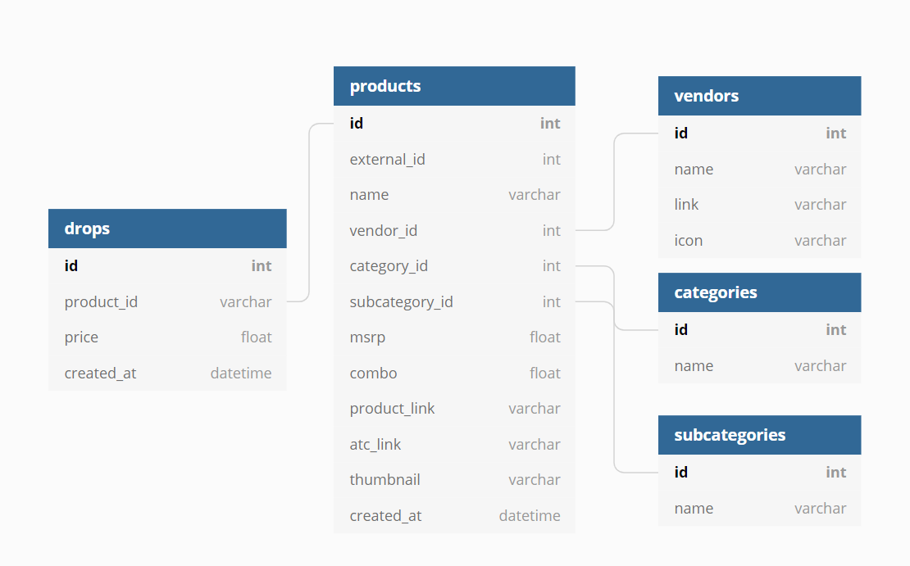

# Track Product Drops with Discord Notifications

The goal of this project is to provide subscribers with the means to identify when product drops they are interested in become avialable and provide them with links to allow them to checkout the product.

## Database schema

To achieve this I am currently scraping the following sites every 10 minutes for availability:
 - Best Buy
 - Amazon
 - Micro Center
 - Newegg

If a product is available, it will then send a notifications to discord for subscribers of a channel to be alerted.

Then the product drops are stored to allow for analysis or retrieve of historical drops.

